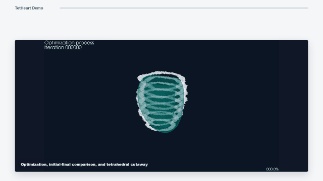
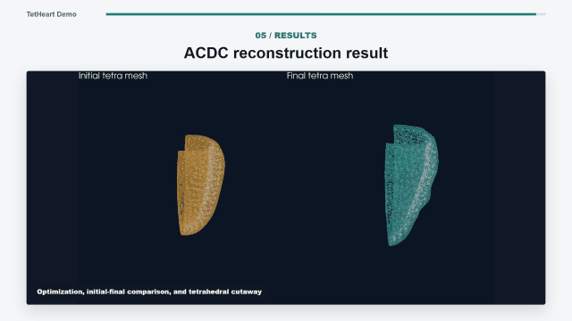
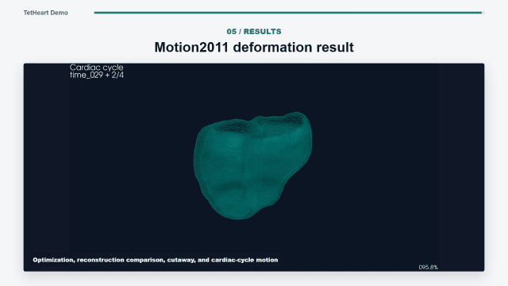

# MRI-TET

MRI-TET is a research codebase for deforming tetrahedral cardiac meshes from 3D medical-image label supervision. The current pipeline optimizes a tetrahedral volume mesh against a NIfTI label volume using a differentiable soft tetrahedral occupancy renderer, geometric regularization, periodic mesh rebasing, and optional global similarity correction.

This repository is intended as paper/research code. It is not a packaged library; scripts are designed to be run from the repository root.

## Demo

### ACDC Result



### Motion2011 Result



### Whole-Heart Result



[Open the full-resolution demo video](assets/demo-video.mp4)

## Method Overview

MRI-TET represents the heart as a tetrahedral mesh and renders the mesh into a soft occupancy volume. Training minimizes the mismatch between rendered occupancy and a target NIfTI label mask while regularizing tetrahedral validity and surface shape.

Core components:

- Tetrahedral mesh model with root vertices and optional NVP/INN deformation.
- Soft tetrahedral occupancy renderer based on four half-space tests per tetrahedron.
- 3D Dice and L1 volume losses against NIfTI label masks.
- Tetrahedron non-inversion loss and quality loss.
- Boundary surface displacement/Laplacian/dihedral preservation regularization.
- Optional global translation, rotation, and anisotropic scale during training.
- Rebase step that bakes the current deformation/global transform into the mesh.
- Final mesh quality evaluation: MR p05/p50, RR p05/p50, RR < 0.2 count, and negative-volume count.

## Repository Layout

```text
train_tet_soft_volume_rebase_nvp_global_clean.py  Main single-case trainer.
train_tet_soft_volume_rebase_nvp.py               Legacy/simple single-case trainer used by whole-heart direct.
train_whole_heart_direct.py                       Single whole-heart wrapper using the legacy trainer.

batch_train_acdc_shift_corrected_global_clean.py  ACDC batch, aligned mesh + label, global-clean trainer.
batch_train_acdc_testing_ghd_global_clean.py      ACDC/GHD-style batch, global-clean trainer.
batch_train_motion2011_template.py                Sequential Motion2011 template/follow-up batch.
batch_train_whole_heart_direct.py                 Whole-heart direct batch.
batch_register_and_train_template.py              Generic template-register-then-train batch.
batch_train_acdc_shift_corrected_mri_tet.py       Legacy ACDC direct batch using train_tet_soft_volume_rebase_nvp.py.
batch_train_acdc_test_template.py                 Legacy/template ACDC test batch.
batch_train_cmrxmotion_template.py                CMRxMotion template batch.

eval_tet_mesh.py                                  Final tetrahedral mesh quality evaluator.
tet_mesh_quality.py                               Low-level tetra mesh quality metrics.
render_tet_soft_volume.py                         Render a tetra mesh to a NIfTI-aligned occupancy volume.
compute_msh_nii_geometric_dice.py                 Mesh-to-label geometric Dice utility.

arguments/                                        Shared model/optimization parameters.
gaussian_renderer/                                Soft tetra occupancy and volume-grid utilities.
scene/                                            Tetra model, NVP/INN deformation networks, mesh data readers.
utils/                                            Core NIfTI, registration, geometry, and training helpers.
submodules/simple-knn/                            CUDA extension required by inherited model code.
tiny-cuda-nn/                                     Optional/local tiny-cuda-nn source for NVP hash-grid components.
```

## Environment

Recommended baseline follows the official StructuredField environment:

- Python 3.9.
- PyTorch 2.0.1.
- CUDA 11.8.
- A working C++/CUDA build toolchain for local CUDA extensions.

Create the conda environment:

```bash
conda env create -f environment.yml
conda activate mri-tet
```

Equivalent manual setup:

```bash
conda create -n mri-tet python=3.9 -y
conda activate mri-tet
conda install cudatoolkit=11.8 pytorch==2.0.1 torchvision=0.15.2 torchtriton=2.0.0 -c pytorch -c nvidia
pip install -r requirements.txt
```

`requirements.txt` starts from the StructuredField dependency stack:

```text
opencv-python
joblib
plyfile
meshio
tqdm
nerfstudio
git+https://github.com/NVlabs/tiny-cuda-nn/#subdirectory=bindings/torch
```

and adds MRI-TET medical-volume dependencies such as `nibabel`, `scipy`, `trimesh`, `matplotlib`, `tensorboard`, `scikit-image`, `pyvista`, `SimpleITK`, and `pydicom`.

Build local CUDA extensions:

```bash
pip install ./submodules/simple-knn
```

If you prefer the bundled `tiny-cuda-nn` source instead of the GitHub pip URL in `requirements.txt`, install it locally:

```bash
pip install ./tiny-cuda-nn/bindings/torch
```

The original StructuredField repository also builds `submodules/diff-gaussian-rasterization`; MRI-TET's current soft-volume path does not use that rasterizer, so it is not required for the main medical-volume workflows.

## Input Data

The single-case trainer accepts either:

- `--template-msh`: a template tetrahedral `.msh` mesh that will be registered to the target NIfTI label, or
- `--mesh`: an already aligned tetrahedral `.msh` mesh.

Required label input:

- `--label-nifti`: target NIfTI label volume.
- `--label-value`: foreground label value. Use `2` for myocardium in ACDC-style labels; use `-1` in some whole-heart scripts to train all nonzero labels as foreground.

Coordinate convention:

- Training uses a centered local NIfTI grid.
- Template registration uses `--target-rescale 0.01` by default.
- If a mesh is already in the training local frame, pass `--mesh-is-local`.
- Direct whole-heart scripts center the mesh by `(mesh_xyz_mm - nifti_center_mm_xyz) * coordinate_scale`.

## Single-Case Training

Recommended current trainer:

```bash
python train_tet_soft_volume_rebase_nvp_global_clean.py \
  --template-msh path/to/template.msh \
  --label-nifti path/to/label.nii.gz \
  --label-value 2 \
  --model-path outputs/case001 \
  --iterations 2000 \
  --rebase-every 100 \
  --save-final-volume
```

Train from an already aligned local mesh:

```bash
python train_tet_soft_volume_rebase_nvp_global_clean.py \
  --mesh path/to/aligned_local_mesh.msh \
  --mesh-is-local \
  --label-nifti path/to/label.nii.gz \
  --label-value 2 \
  --model-path outputs/case001 \
  --iterations 1000 \
  --rebase-every 200 \
  --save-final-volume
```

Important options:

| Option | Purpose |
| --- | --- |
| `--iterations` | Number of optimization steps. |
| `--rebase-every` | Bake current deformation/global transform into the base mesh every N steps. |
| `--alpha`, `--alpha-final` | Soft half-space sigmoid sharpness schedule. |
| `--halfspace-bias`, `--halfspace-bias-final` | Soft half-space occupancy bias schedule. |
| `--render-mode` | Tetra occupancy aggregation mode: `prob_union`, `sum`, `sum_clip`, or `max`. |
| `--lambda-volume-dice` | Weight for 3D soft Dice loss. |
| `--lambda-volume-l1` | Weight for occupancy L1 loss. |
| `--lambda_quality`, `--lambda_quality_final` | Tetra shape quality loss weights. |
| `--lambda_relu_tet` | Non-inversion loss weight for negative signed tetra volumes. |
| `--lambda_surface_smooth` | Boundary surface smoothness/preservation weight. |
| `--lambda_surface_dihedral` | Boundary adjacent-face dihedral preservation weight. |
| `--global-translation-lr` | Learning rate for global translation. |
| `--global-rotation-lr` | Learning rate for global rotation. |
| `--global-scale-lr` | Learning rate for global anisotropic scale. |
| `--no-optimize-global-transform` | Disable global transform optimization. |

Current note on NVP/INN:

- The model supports NVP/INN deformation through `scene/hierarchical_tetrahedra_model.py`.
- In the current global-clean trainer, the loop calls `tets.freeze_inn()`, so the active training path is direct vertex optimization plus optional global transform.
- To use pure NVP training, freeze `_xyz` and unfreeze INN/NVP explicitly in the training loop.

## Outputs

A training run writes:

```text
cfg_args
training_summary.json
loss_history.jsonl
loss_curve.png
tetra_final_soft_volume_rebase.msh
final_evaluation.json
rebased_meshes/
pred_occ_final.npy
pred_mask_final.npy
gt_mask.npy
pred_occ_final.nii.gz
pred_mask_final.nii.gz
gt_mask.nii.gz
```

`training_summary.json` includes final Dice metrics, mesh paths, rebase history, global transform state, and final mesh quality fields when evaluation succeeds.

`final_evaluation.json` includes:

```text
mean_ratio_p05
mean_ratio_p50
radius_ratio_p05
radius_ratio_p50
radius_ratio_lt_0p2_count
negative_signed_volume_count
```

## Batch Workflows

### ACDC Shift-Corrected Global Clean

Use this when each patient folder contains a matched aligned `.msh` and NIfTI label.

```bash
python batch_train_acdc_shift_corrected_global_clean.py \
  --data-root path/to/acdc_testing_shift_corrected_masks \
  --output-root outputs/acdc_global_clean \
  --iterations 1000 \
  --rebase-every 200 \
  --save-every 200 \
  --tetra-chunk-size 256 \
  --block-size 8 8 8
```

This calls `train_tet_soft_volume_rebase_nvp_global_clean.py` by default and writes per-case summaries plus `mri_tet_acdc_batch_summary.json`.

### ACDC Testing/GHD Global Clean

```bash
python batch_train_acdc_testing_ghd_global_clean.py \
  --data-root path/to/acdc_testing_or_ghd_root \
  --output-root outputs/acdc_testing_ghd_global_clean \
  --iterations 1000 \
  --rebase-every 200
```

This is the same global-clean training path with dataset-specific defaults.

### Motion2011 Sequential Template Batch

```bash
python batch_train_motion2011_template.py \
  --template-msh path/to/template.msh \
  --data-root path/to/motion_data_seg_rvmyo_zflip \
  --output-root outputs/motion2011_template_batch \
  --first-iterations 1000 \
  --follow-iterations 200 \
  --rebase-every 100 \
  --save-final-volume
```

The first time point is aligned from the template. Follow-up time points are aligned from the previous trained final mesh. The script writes per-subject `dice_summary.json`, a global `manifest.json`, and mesh quality fields for each trained time point.

### Whole-Heart Direct Batch

```bash
python batch_train_whole_heart_direct.py \
  --data-root path/to/whole_heart \
  --output-root outputs/whole_heart_direct_batch \
  --iterations 100 \
  --coordinate-scale 0.01
```

This script centers each input mesh in the NIfTI training grid and calls `train_whole_heart_direct.py`, which currently wraps the legacy `train_tet_soft_volume_rebase_nvp.py` trainer. It writes `whole_heart_direct_batch_summary.json` with mesh quality statistics.

### Generic Template Register And Train

```bash
python batch_register_and_train_template.py \
  --template-msh path/to/template.msh \
  --data-root path/to/labels \
  --label-glob "**/*label.nii.gz" \
  --output-root outputs/template_registered_batch \
  --registration-labels 2 \
  --label-value 2 \
  --iterations 2000
```

This is a generic template-to-label batch wrapper. It is useful when a dataset has NIfTI labels but no case-specific aligned meshes.

## Evaluation

Evaluate tetrahedral mesh quality:

```bash
python eval_tet_mesh.py \
  --mesh outputs/case001/tetra_final_soft_volume_rebase.msh \
  --json-out outputs/case001/final_evaluation.json
```

Compute mesh-vs-NIfTI geometric Dice:

```bash
python compute_msh_nii_geometric_dice.py \
  --mesh path/to/mesh.msh \
  --label-nifti path/to/label.nii.gz \
  --label-value 2
```

Render a tetra mesh into a NIfTI-aligned occupancy volume:

```bash
python render_tet_soft_volume.py \
  --mesh path/to/mesh.msh \
  --label-nifti path/to/reference_label.nii.gz \
  --output-dir outputs/render_check
```

## Script Reference

| Script | Role |
| --- | --- |
| `train_tet_soft_volume_rebase_nvp_global_clean.py` | Main single-case global-clean trainer. |
| `train_tet_soft_volume_rebase_nvp.py` | Legacy/simple trainer retained for whole-heart direct compatibility. |
| `train_whole_heart_direct.py` | Centers one whole-heart mesh and calls the legacy trainer. |
| `batch_train_acdc_shift_corrected_global_clean.py` | ACDC aligned-mesh global-clean batch. |
| `batch_train_acdc_testing_ghd_global_clean.py` | ACDC/GHD global-clean batch. |
| `batch_train_motion2011_template.py` | Sequential Motion2011 template/follow-up batch. |
| `batch_train_whole_heart_direct.py` | Whole-heart direct batch with mesh-quality summary. |
| `batch_register_and_train_template.py` | Generic template-registration batch. |
| `batch_train_acdc_shift_corrected_mri_tet.py` | Legacy ACDC direct batch using the legacy trainer. |
| `batch_train_acdc_test_template.py` | Legacy ACDC test template batch. |
| `batch_train_cmrxmotion_template.py` | CMRxMotion template batch. |
| `eval_tet_mesh.py` | Final tetra mesh quality evaluator. |
| `tet_mesh_quality.py` | Standalone low-level tetra mesh quality tool. |
| `render_tet_soft_volume.py` | Soft occupancy rendering utility. |
| `compute_msh_nii_geometric_dice.py` | Mesh-to-label geometric Dice utility. |

Core helper modules under `utils/`:

| Module | Role |
| --- | --- |
| `utils/volume_training_helpers.py` | NIfTI loading, ROI construction, volume losses, export, TensorBoard/loss artifacts. |
| `utils/template_registration.py` | Template-to-label similarity ICP and label boundary sampling. |
| `utils/geo_utils.py` | Differentiable tetrahedral geometry and quality functions. |
| `utils/graphics_utils.py` | Shared point/tetra data containers and camera math inherited from StructuredField. |
| `utils/general_utils.py` | Learning-rate schedules, transforms, tensor helpers. |
| `utils/system_utils.py` | Filesystem/checkpoint helper functions. |
| `utils/sh_utils.py` | Spherical harmonics helpers retained for StructuredField compatibility. |
| `utils/mri_utils.py` | MRI/NIfTI image utilities used by dataset readers. |
| `utils/create_tetra_init.py` | Fallback tetra-grid initialization used by dataset readers. |
| `utils/camera_utils.py` | Camera conversion helpers retained for inherited scene loading. |

## Development Notes

- Run scripts from the repository root so relative imports resolve.
- CUDA is expected for training. CPU execution is not a supported performance path.
- Large outputs should be written under `outputs/`, `output/`, or another ignored experiment directory.
- The bundled `tiny-cuda-nn/` tree is third-party source and intentionally kept separate from MRI-TET project scripts.
- The current paper-ready path is the global-clean trainer plus the dataset batch wrappers listed above. Older experimental entry points have been removed from the root to keep the repository focused.

## Citation

If you use this code, please cite the associated paper when available.
