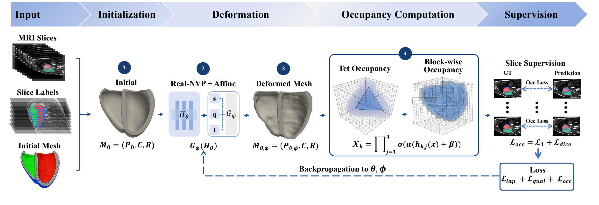
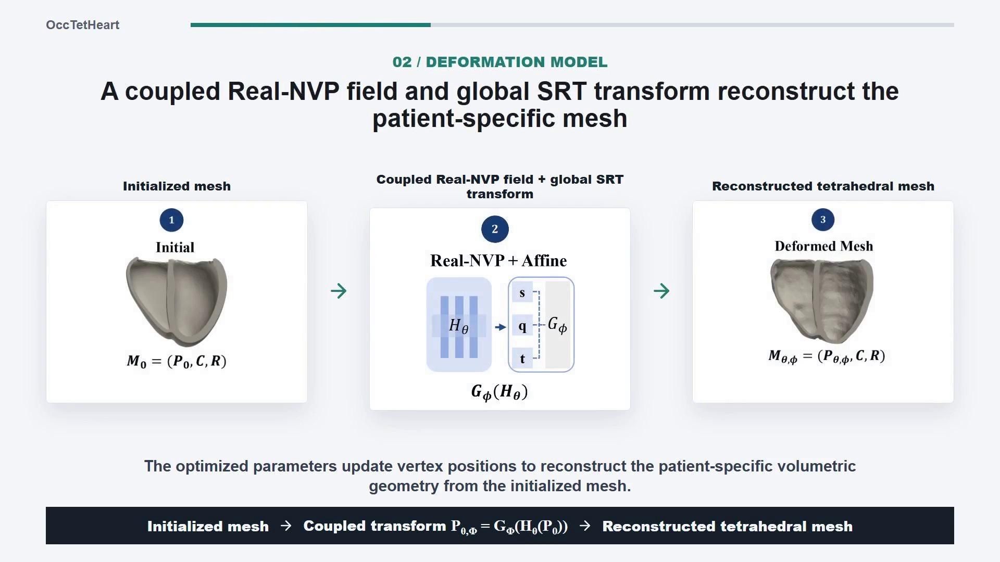

# OccTetHeart

OccTetHeart reconstructs cardiac tetrahedral volume meshes from 3D segmentation supervision. Starting from a template or an aligned tetrahedral mesh, it renders a differentiable occupancy field on the target NIfTI grid and optimizes the mesh with occupancy and geometric regularization losses.

This repository contains the research implementation accompanying the OccTetHeart method. Run all commands from the repository root.

## Framework

<p align="center">
  
</p>

<p align="center">
  <a href="assets/framework1.pdf">View the framework figure as PDF</a>
</p>

## Demo Video

<p align="center">
  <a href="https://github.com/ManZuRen/OccTetHeart/raw/refs/heads/main/assets/demo-video-latest.mp4">
    
  </a>
</p>

<p align="center">
  <a href="https://github.com/ManZuRen/OccTetHeart/raw/refs/heads/main/assets/demo-video-latest.mp4"><strong>▶ Play the full OccTetHeart demo (MP4, 2:27)</strong></a>
</p>

## Results

### ACDC Result


### Motion2011 Result


### Whole-Heart Result


## Method

OccTetHeart uses:

- a deformable tetrahedral volume mesh;
- a differentiable soft occupancy renderer based on tetrahedral half-spaces;
- 3D Dice and L1 supervision from NIfTI label volumes;
- non-inversion, tetrahedral quality, and boundary-surface regularization;
- optional global similarity optimization and periodic mesh rebasing.

The current paper-ready path uses `train_tet_soft_volume_rebase_nvp_global_clean.py`. The simpler trainer is retained for compatibility with the whole-heart workflow.

## Installation

The reference setup uses Python 3.9, PyTorch 2.0.1, and CUDA 11.8.

```bash
conda env create -f environment.yml
conda activate occtetheart
pip install ./submodules/simple-knn
```

Alternatively, install the packages in `requirements.txt` in an existing compatible CUDA environment. Training is CUDA-oriented; CPU execution is not intended as a practical training path.

## Input

The single-case trainer requires a target label volume:

- `--label-nifti`: a NIfTI label volume (`.nii` or `.nii.gz`);
- `--label-value`: the foreground label, such as `2` for ACDC myocardium.

Provide one of the following mesh inputs:

- `--template-msh`: a template tetrahedral mesh registered to the target before optimization;
- `--mesh`: an already aligned tetrahedral mesh; add `--mesh-is-local` if it is already in OccTetHeart's centered training coordinates.

The default template-registration scale is `0.01`.

## Training

Single-case reconstruction from a template:

```bash
python train_tet_soft_volume_rebase_nvp_global_clean.py \
  --template-msh path/to/template.msh \
  --label-nifti path/to/label.nii.gz \
  --label-value 2 \
  --model-path outputs/case001 \
  --iterations 2000 \
  --rebase-every 100 \
  --save-final-volume
```

Training from an aligned local mesh:

```bash
python train_tet_soft_volume_rebase_nvp_global_clean.py \
  --mesh path/to/aligned_local_mesh.msh \
  --mesh-is-local \
  --label-nifti path/to/label.nii.gz \
  --label-value 2 \
  --model-path outputs/case001 \
  --iterations 1000 \
  --save-final-volume
```

The most commonly adjusted options are `--iterations`, `--rebase-every`, `--tetra-chunk-size`, `--block-size`, and the `--lambda-*` loss weights. Run a script with `--help` for the full option list.

## Batch workflows

The main dataset entry points are:

- `batch_register_and_train_template.py`: generic template registration and training for NIfTI label datasets;
- `batch_train_acdc_shift_corrected_global_clean.py`: ACDC aligned-mesh workflow;
- `batch_train_acdc_testing_ghd_global_clean.py`: ACDC/GHD-style workflow;
- `batch_train_motion2011_template.py`: sequential Motion2011 reconstruction;
- `batch_train_whole_heart_direct.py`: binary whole-heart reconstruction.

Example generic batch command:

```bash
python batch_register_and_train_template.py \
  --template-msh path/to/template.msh \
  --data-root path/to/labels \
  --label-glob "**/*label.nii.gz" \
  --output-root outputs/template_batch \
  --registration-labels 2 \
  --label-value 2 \
  --iterations 2000
```

## Outputs

Each run writes a final tetrahedral mesh, configuration and training summaries, loss history, and rebased intermediate meshes. With `--save-final-volume`, it also exports predicted occupancy/masks and the ground-truth mask as NumPy and NIfTI files.

Typical files include:

```text
tetra_final_soft_volume_rebase.msh
training_summary.json
final_evaluation.json
loss_history.jsonl
loss_curve.png
rebased_meshes/
pred_occ_final.nii.gz
pred_mask_final.nii.gz
gt_mask.nii.gz
```

## Utilities

- `eval_tet_mesh.py`: tetrahedral mesh quality evaluation;
- `compute_msh_nii_geometric_dice.py`: mesh-to-label geometric Dice;
- `render_tet_soft_volume.py`: occupancy rendering on a NIfTI-aligned grid;
- `utils/template_registration.py`: template-to-label similarity registration;
- `utils/volume_training_helpers.py`: volume loading, losses, and export helpers.

## Acknowledgements

The environment and parts of the inherited model infrastructure build on StructuredField. The main OccTetHeart medical-volume path uses its own tetrahedral occupancy renderer and does not require the inherited Gaussian rasterizer.

## Citation

Please cite the associated OccTetHeart paper when it becomes available.
